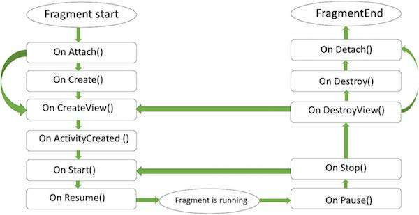
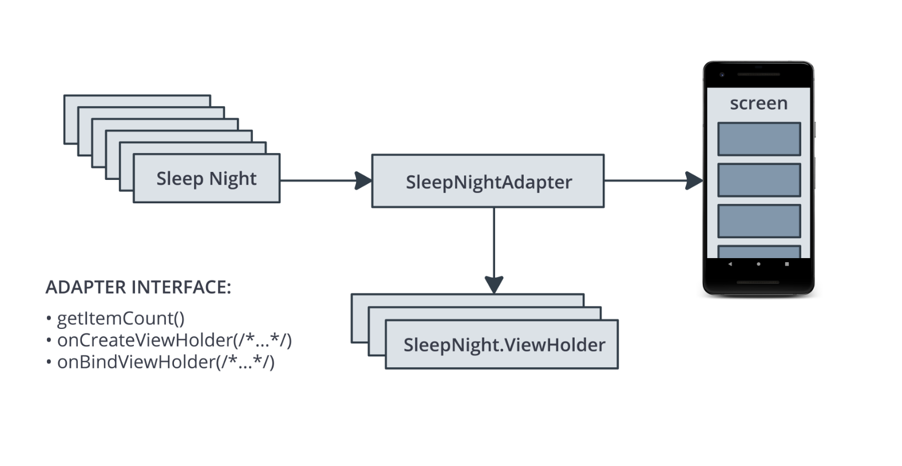
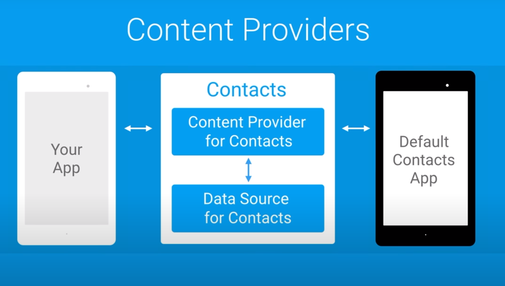
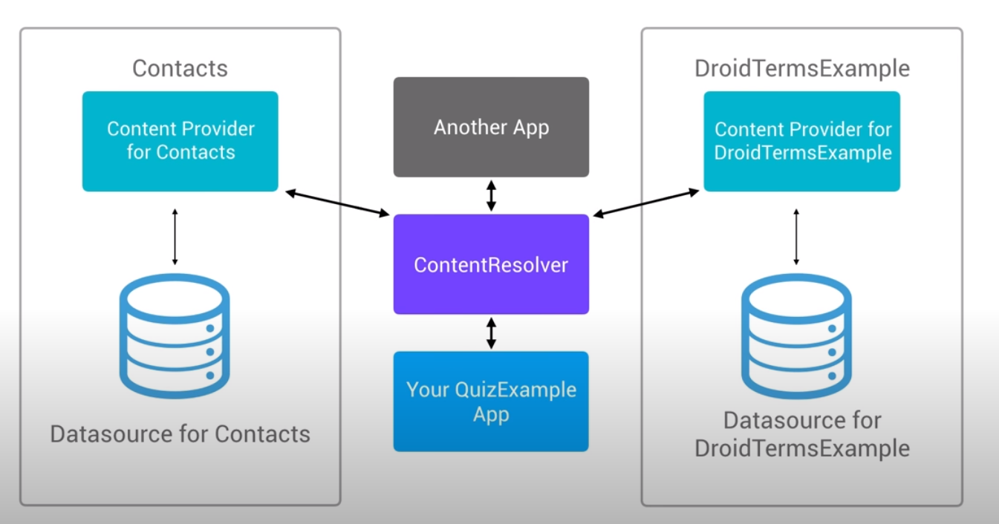

:revealjs_theme: sky
:revealjs_slideNumber: true

== Android Revisited!

[background-color="aquamarine"]
=== Structure

1. Fragments
2. Recycler View
3. Provider

== Fragments

[background-color="aquamarine"]
=== What are Fragments?

--
A way to couple xml with java source code,
so a view with UI logics
(Does not have to have a view)
--
[%notitle]
=== Slide Two
image::https://d2h0cx97tjks2p.cloudfront.net/blogs/wp-content/uploads/sites/2/2020/02/android-fragment-interaction-with-activity-in-devices-1.jpg[canvas,size=contain]

=== Fragment life-cycle

[background-color="aquamarine"]
=== Advantages of Fragments

* Fragments are more reusable than views
* Basically a small activity
* Good to use when working on tablet compatible apps

[background-color="aquamarine"]
=== Use cases for fragments

* If you have a feature that can be reused (aka. Progress Bars)

[background-color="aquamarine"]
=== Why fragments shouldn't be overused

* Backstack of the fragments in navigation is complicated
* Support library updates may cause new and unexpected ways for fragments to behave.
* Testing an app with a lot of fragments is a pain for bug fixing.

== (Recycler) View

image::images/recycleView.jpg[background,size=cover]
--
All about efficiency
--

[background-color="aquamarine"]
=== How does it work?

1. Works with the adapter interface
2. Asks adapter how many items there are
3. Asks adapter for a viewHolder and draws the item in the viewHolder

=== !

[background-color="aquamarine"]
=== Advantages of Recycler view

* Designed to be efficient
* Layout is easily customizable and can be shown in many ways
* Is reusing as much as it can, making the app more efficient
* more efficient sibling of list- and gridview

== (Content) Provider

[background-color="aquamarine"]
=== What is a (Content) Provider
--
A class that sits between an app and it's data source, which provides managed
access to the abstract data.
--
=== What does it do?
--
It can grab or write data to a users contacts, documents or calendar for example
--
=== !

[background-color="aquamarine"]
=== Advantages

* It is abstract from the other data sources.
* Leverage functionality of Android Classes (ex. Loaders)
* Allow many apps to access, use and modify a single data source securely

[background-color="aquamarine"]
=== How do you set your Provider?

--
*With a Content-Resolver*
--

=== *Content Resolver*

== Used Sources:
--
[preview=true]
https://classroom.udacity.com/courses/ud851/lessons/c81cb722-d20a-495a-83c6-6890a6142aac/concepts/367dc8f7-4639-4650-8468-b08717a69e84
[preview=true]
https://classroom.udacity.com/courses/ud851/lessons/b071166b-dec4-4468-b419-422e3ab0194d/concepts/3895160f-4375-4005-8b71-9057aaf4da20
--

=== !

--
[preview=true]
https://classroom.udacity.com/courses/ud9012/lessons/7466f670-3d47-4b60-8f6a-0914ce58f9ad/concepts/d6d0f3cc-6683-4b2d-b97e-5ac2c0495103
[preview=true]
https://classroom.udacity.com/courses/ud9012/lessons/ee5a525f-0ba3-4d25-ba29-1fa1d6c567b8/concepts/2a5cd87b-127a-4baf-b3f2-850f067b1a9e
--